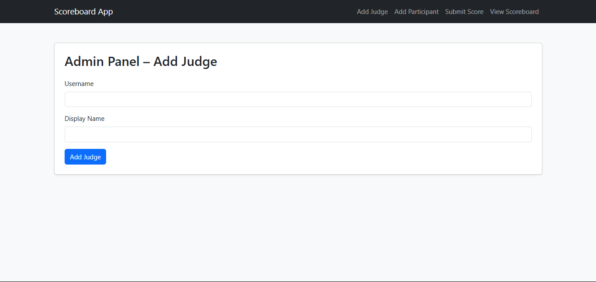
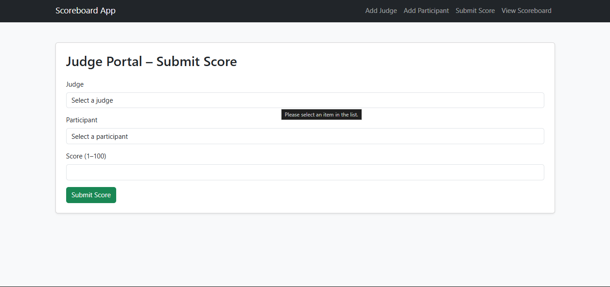
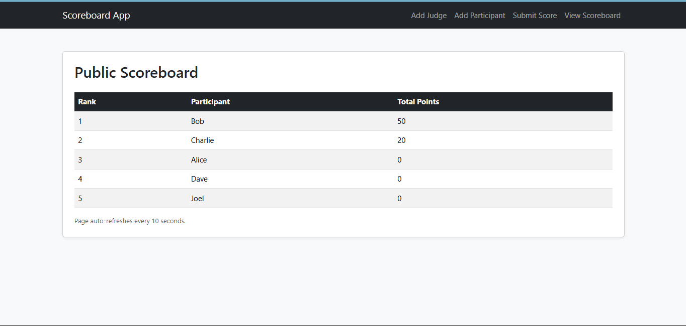

# Scoreboard App

## Overview

This is a simple LAMP stack web application designed for a competition scoring system.  
- Admins can add judges via an Admin Panel.  
- Judges can assign scores to participants through a Judge Portal.  
- A public scoreboard displays participants ranked by their total points with dynamic highlighting and auto-refresh.  

---

## Demo

🎥 Watch a walkthrough of the project: [Loom Video Link](https://loom.com/share/your-video-id)

---

### 🌍 Live Demo
Access the live scoreboard app: [https://scoreboard-app.onrender.com](https://scoreboard-app.onrender.com)


## Features

- Admin Panel for managing judges  
- Judge Portal to submit scores  
- Public scoreboard with real-time updates (auto-refresh every 10 seconds)  
- Prevents duplicate scoring by the same judge for the same participant  
- Bootstrap 5 styling for a modern, responsive UI  

---

## Technologies Used

- **Linux** (Development on WSL Ubuntu)  
- **Apache** (HTTP server)  
- **MySQL** (Database)  
- **PHP** (Server-side scripting)  
- **Bootstrap 5** (Frontend CSS framework)

---

## Setup & Installation

1. **Clone the repository**

```bash
git clone https://github.com/yourusername/scoreboard_app.git
cd scoreboard_app
```
---

## Create the database and tables

```bash
CREATE DATABASE scoreboard_app;
USE scoreboard_app;

CREATE TABLE judges (
    id INT AUTO_INCREMENT PRIMARY KEY,
    username VARCHAR(50) UNIQUE NOT NULL,
    display_name VARCHAR(100) NOT NULL
);

CREATE TABLE participants (
    id INT AUTO_INCREMENT PRIMARY KEY,
    name VARCHAR(100) NOT NULL
);

CREATE TABLE scores (
    id INT AUTO_INCREMENT PRIMARY KEY,
    judge_id INT NOT NULL,
    participant_id INT NOT NULL,
    score INT NOT NULL,
    FOREIGN KEY (judge_id) REFERENCES judges(id),
    FOREIGN KEY (participant_id) REFERENCES participants(id)
);

```

---

## Configure database connection

- Create a .env file in the project root with:

```bash

DB_HOST=your-host
DB_USER=your-username
DB_PASS=your-password
DB_NAME=your-db-name
```
- Update db.php to read from .env and connect to the database securely

---

## Set up your Apache server

- Ensure PHP and MySQL are installed and running.
- Place the project files in your web root (/var/www/html/scoreboard_app or similar)

---

## Folder structure

```
📂 scoreboard_app/
 ┣  .env  # Environment variables
 ┣  admin.php      # Admin landing page
 ┣  admin_panel.php        # Admin - add judges
  ┣  add_participant.php # Admin - Add participants
 ┣ judge_portal.php  # Judge scoring interface
 ┣  scoreboard.php   # Public scoreboard
📂 assets/   # (Optional) Folder for images, styles, etc.
 ┣  README.md             # Project documentation


```

---

## Run the application

- Access the Admin Panel: http://localhost/scoreboard_app/admin_panel.php
- Judge Portal: http://localhost/scoreboard_app/judge_portal.php
- Public Scoreboard: http://localhost/scoreboard_app/scoreboard.php

---

## Screenshots

### Admin Panel


### Judge Portal


### Public Scoreboard



## Assumptions

- User authentication is out of scope for this demo.

- Judges and participants are manually added via Admin Panel and direct DB inserts respectively.

- Scores range from 1 to 100 points.

- The application runs on a local or internal server; no HTTPS enforcement implemented.

---

## Design choices

- Used prepared statements to prevent SQL injection.

- Bootstrap 5 for clean and responsive UI without heavy frontend frameworks.

- Scores table stores individual judge-participant scores to allow flexible aggregation.

- Auto-refresh for scoreboard implemented via HTML meta tag for simplicity.

---

## Future improvements

- Add user authentication and role-based access control.

- Enhance UI with AJAX for real-time score submission and dynamic scoreboard updates without full page reload.

- Add participant registration flow.

- Deploy on cloud hosting with HTTPS.

- Improve error handling and logging.

--- 

## Related Blog Post

I wrote a blog post about the development process and technical decisions behind this project:

👉 [Read the blog here](https://yourblog.com/your-post)

---

## License

- This project is licensed under the MIT License.


